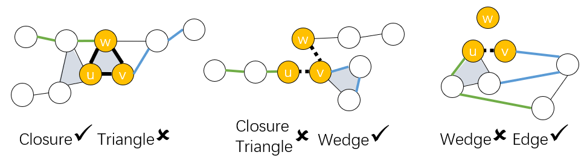

# Neural Higher-order Pattern (Motif) Prediction in Temporal Networks

# Overview
Dynamic systems that consist of a set of interacting elements can be abstracted as temporal networks. Recently, higher-order patterns that involve multiple interacting nodes have been found crucial to indicate domain-specific laws of different temporal networks. This posts us the challenge of designing more sophisticated hypergraph models for these higher-order patterns and the associated new learning algorithms. Here, we propose the first model, named HIT, for higher-order pattern prediction in temporal hypergraphs. Particularly, we focus on predicting three types of common but important interaction patterns involving three interacting elements in temporal networks, which could be extended to even higher-order patterns. HIT extracts the structural representation of anode triplet of interest on the temporal hypergraph and uses it to tell what type of, when, and why the interaction expansion could happen in this triplet. HIT could achieve significant improvement (averaged 20% AUC gain to identify the interaction type, uniformly more accurate time estimation) compared to both heuristic and other neural-network-based baselines on 5 real-world large temporal hypergraphs. Moreover, HIT provides a certain degree of interpretability by identifying the most discriminatory structural features on the temporal hypergraphs for predicting different higher-order patterns.


# Requirements
* `python = 3.7`, `PyTorch = 1.4`, please refer to their official websites for installation details.
* Other dependencies:
```{bash}
pandas==0.24.2
tqdm==4.41.1
numpy==1.16.4
scikit_learn==0.22.1
matploblib==3.3.2
```
Refer to `environment.yml` for more details.

# Run the code
## Preprocess the dataset
#### Option 1: Use our data

Preprocess dataset
```{bash}
mkdir processed
python preprocess.py -d tags-ask-ubuntu
```

This code is to preprocess the dataset, including zero-padding the node features and edge features.

#### Option 2: Use your own data
First download the dataset, for example https://www.cs.cornell.edu/~arb/data/
```{bash}
unzip dataset.zip
mkdir processed
python preprocess.py -d <dataset>
```

Before running the code, check if ./log exists. If not, 

```{bash}
mkdir log
```

After preprocessing the dataset, we can run the code for three different questions.
## For Q1 type prediction
The task aims to solve the Q1 in the paper. What type of high-order interaction will most likely appear among u,v,w within (t, t + T_W]?

```{bash}
export OMP_NUM_THREADS=1
python main.py -d tags-ask-ubuntu
```

The output will be in the log file. We will both report the AUC and the confusion matrix.

## For Q2 time prediction
The task aims to solve the Q2 in the paper. For a triplet ({u, v}, w, t), given an interaction pattern in {Wedge, Triangle, Closure}, when will u, v, w first form such
a pattern?

```{bash}
export OMP_NUM_THREADS=1
mkdir time_prediction_output
python main.py -d tags-ask-ubuntu --time_prediction --time_prediction_type <time_prediction_type>
```
## Optional arguments
```{txt}
    --time_prediction_type For interpretation, we have 3 tasks. 1: Closure; 2: Triangle; 3: Wedge;  Default 0 means no time_prediction
```

The output will be in the ./time_prediction_output/ <dataset>_<time_prediction_type>.txt.
We report the NLL loss and MSE for training, validating, and testing sets.


## For Q3 interpretation
```{bash}
export OMP_NUM_THREADS=1
mkdir interpretation_output
python main.py -d tags-ask-ubuntu --interpretation --interpretation_type 1
```

## Optional arguments
```{txt}
    --interpretation_type: Interpretation type: For interpretation, we have 3 tasks. 1: Closure vs Triangle; 2: Closure + Triangle vs Wedge; 3: Wedge and Edge; Default 0 means no interpretation
```
The output will be in the ./interpretation_output/ <dataset>_<interpretation_type>.txt.
We report all the pattern we sample, with the times of each pattern appears in the first class and the total times it appears in both classes, and their ratio. We also report the mean score and variance of each pattern.


# Note

Finding edges, wedges, triangles, and closures process is in th utils.py. Since the finding process is time-consuming, the code will automatically save all the edges, wedges, triangles, closures in the saved_triplets. So the code doesn't need to run the process again in the future experiments.

# Some Results

What type of interaction between w and u,v will appear if there is any? Our model achieves the following performance. The performance is 1-vs-1 AUC (mean±std) of higher-order pattern prediction.

| Model name         |     tags-math-sx    |  tags-ask-ubuntu  |   congress-bills   |       DAWN       |   threads-ask-ubuntu  |
| ------------------ | ------------------- | ----------------- | ------------------ | ---------------- | --------------------- |
| HIT                |     77.05 ± 0.31    |    81.62 ± 0.69   |    81.10 ± 0.26    |   76.50 ± 0.79   |      86.25 ± 0.15     |

# Why will such a type of interaction appear?

Our model indicates that Closures are more likely to happen than Triangles when the temporal random walks(TRWs) start from u,v (or w) and jump to some nodes that are directly connected to w (or u,v).  This means that u, v, w tend to form a Closure pattern if both u,w and v,w have common neighbors before.

Compared with Closures and Triangles, Wedges are more likely to occur when the TRWs start from u (or v,w) and jump to some nodes that are still far away from the other two nodes

If u and v have strong connections, i.e., the TRWs jump around u and v, they are more likely to become an Edge instread of a Wedge.



# Main code and functions
    
## preprocess.py
the preprocess of data. Transform the hypergraph to the graph.

## main.py 
the main code, including finding patterns and train/validate/test the model.

## train.py
the main training code.

## module.py
different modules, including the HIT class, classifiers, self-attention pooling, and sum pooling.

## utils.py
functions, including early stopper, ROC score function, and Dataset class.
    
## find_pattern.py
prepare for the HIT model, finding high-order patterns 

## parser.py
parsers
